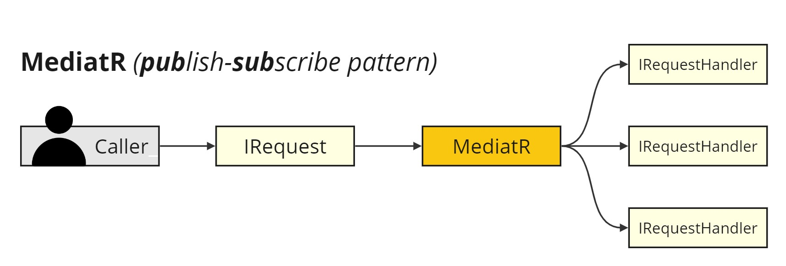

# PT_Demo_NET_MediatR



## Contents
- [Initial Setup](#initial-setup)
- [Links](#links)

## Initial Setup

1. Create a blank .NET 6 Solution `PT_Demo_NET_MediatR` and a .NET 6 Console Application `DemoNetMediatR.API`.

2. Install the following NuGet package:

```
dotnet add package MediatR
```

3. Register in `Program.cs`:

```
        // Add MediatR
        builder.Services.AddMediatR(cfg => cfg.RegisterServicesFromAssembly(typeof(Program).Assembly));
```

4. Create `IRequest` and `IRequestHandler`:

```
public class PingRequest : IRequest<string>
{
}
```

```
public class PingRequestHandler : IRequestHandler<PingRequest, string>
{
    public Task<string> Handle(PingRequest request, CancellationToken cancellationToken)
    {
        return Task.FromResult("Pong");
    }
}

```

5. Inject `MediatR` in a `TestController.cs` class:

```
using DemoNetMediatR.API.Contracts;
using MediatR;
using Microsoft.AspNetCore.Mvc;

namespace DemoNetMediatR.API.Controllers;

[ApiController]
[Route("[controller]")]
public class TestController : ControllerBase
{

    private readonly IMediator _mediator;

    public TestController(IMediator mediator)
    {
        _mediator = mediator;
    }

    [HttpGet("ping")]
    public async Task<IActionResult> GetPing()
    {
        var request = new PingRequest();

        var result = await _mediator.Send(request);

        return Ok(result);
    }
}
```

6. Test by calling the following endpoint:

```
curl -X 'GET' \
  'https://localhost:7215/Test/ping' \
  -H 'accept: */*'
```

Output should be:

```
Code: 200
Response body: Pong
```

## Links
https://github.com/jbogard/MediatR